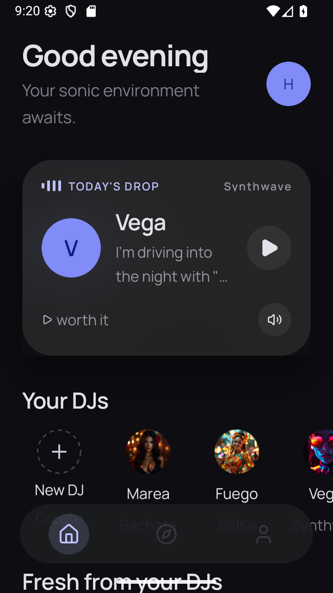
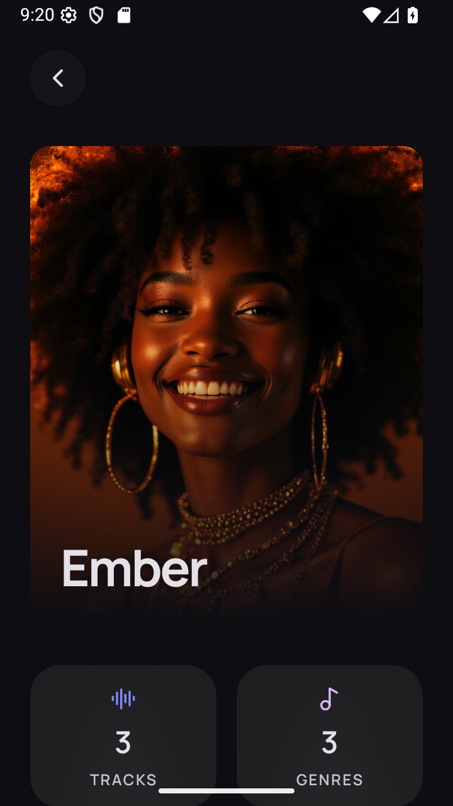
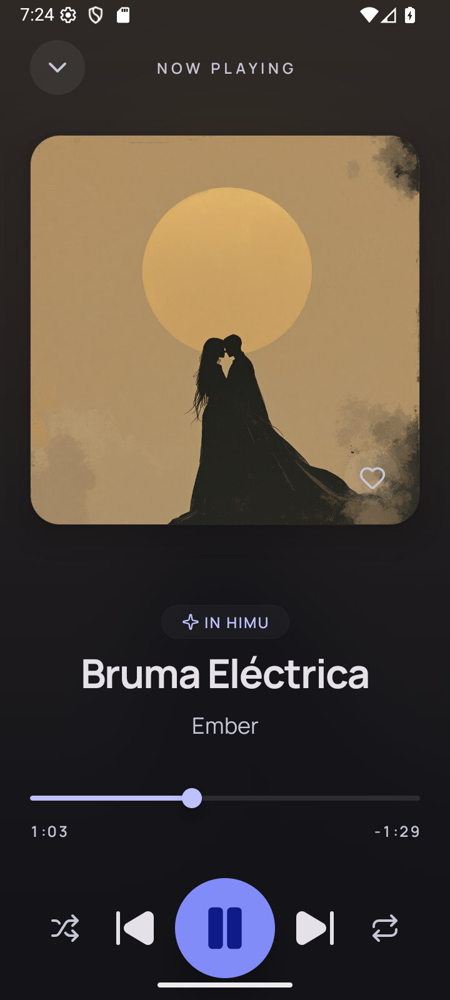
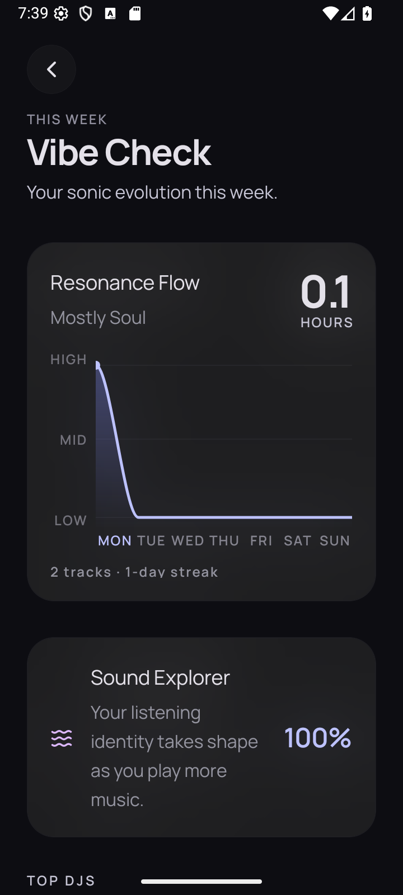
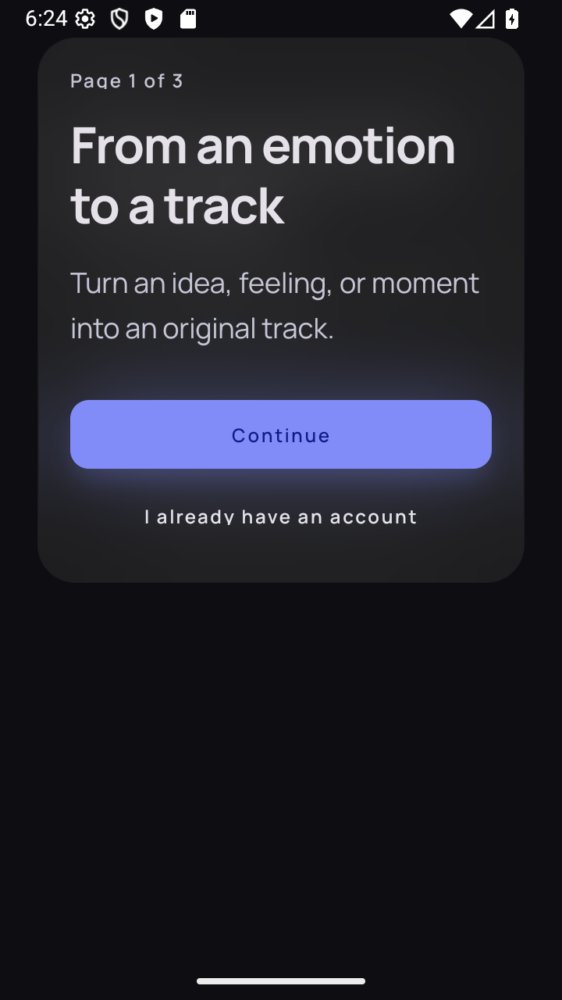
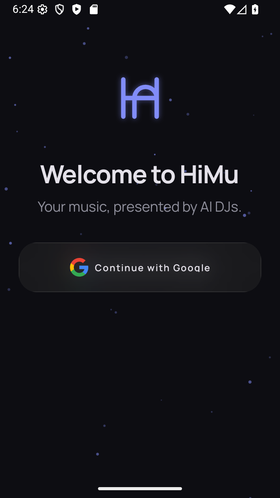
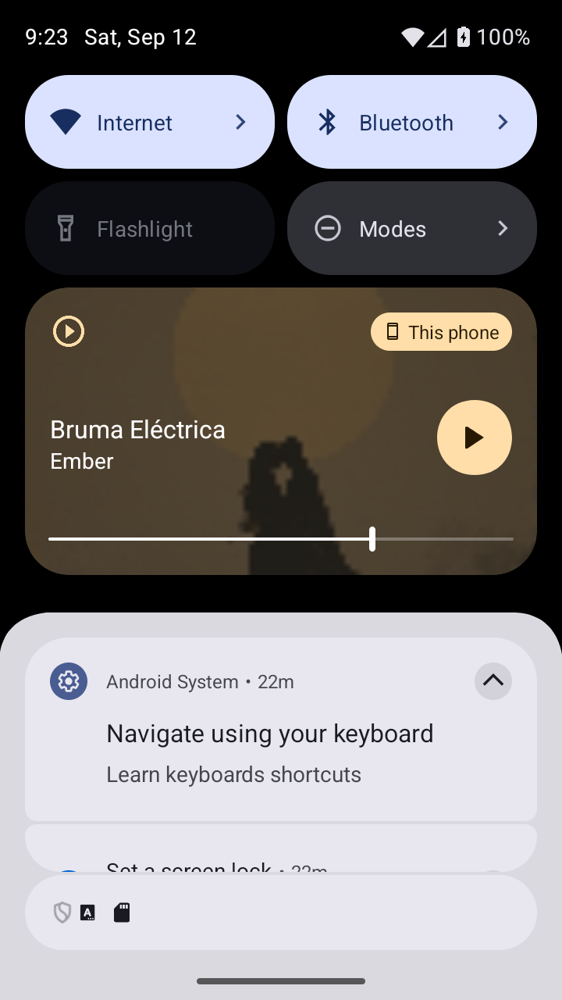

<div align="center">


# HiMu

**Your music, hosted by AI DJs.**

A cross-platform mobile music app built around AI DJ personas. Every DJ has its own
character, signature genres, and curated catalog — stream their tracks through a
full-screen player with background playback, save tracks you like, and watch
your habits come to life in a personal _Vibe Check_.

[](https://expo.dev)
[](https://reactnative.dev)
[](https://www.typescriptlang.org)
[](https://supabase.com)
[](#)
[](LICENSE)

</div>

[](https://reporanker.com/repos/RiveraHan/HiMu)

> **Status:** Beta: core listening and personalization are active; AI generation
> requires the configured Supabase Edge Functions and provider secrets.

---

- [App screenshots](#app-screenshots)
- [Design](#design)
- [Features](#features)
- [Capability status](#capability-status)
- [Testing](#testing)
- [Security and privacy](#security-and-privacy)
- [Tech stack](#tech-stack)
- [Architecture](#architecture)
- [Getting started](#getting-started)
- [Environment variables](#environment-variables)
- [Project structure](#project-structure)
- [Scripts](#scripts)
- [Contributing](#contributing)
- [License](#license)

---

## App screenshots

These are captures of the running Android app with real catalog data and a
disposable QA account. Player and Vibe Check were captured from a standalone APK; Home and the DJ
profile were captured from the development client. See [native validation](NATIVE_TESTING.md)
for dates, build details, and test results.

| Home | DJ profile | Player |
| --- | --- | --- |
|  |  |  |

| Vibe Check |
| --- |
|  |

### Android demo

[Watch the 45-second demo](assets/demos/android-player-vibe-check.mp4): real
playback, pause/resume from the Android lock screen, and Vibe Check with listening
activity from the QA session. Recorded from a standalone APK at 720×1600; the
screen recording has no audio track.

<details>
<summary>Public screens and Android media controls</summary>

| Welcome | Login | System media controls |
| --- | --- | --- |
|  |  |  |

The public welcome/login captures use dummy backend configuration. The media
controls capture uses the real catalog.

</details>

## Design

The original [design references](assets/design/) are mockups made with Stitch.
They are kept separately from the actual app screenshots above.

---

## Features

**🎧 Listening**

- Full-screen player with album art, a scrubbable progress bar, and queue navigation
- Background audio playback (lock screen / control center) on iOS and Android
- MiniPlayer remains available across authenticated browsing and detail screens;
  auth, full Player, Focus Mode, and onboarding intentionally hide bottom chrome
- Browse and discover DJs from Home and Discover

**🎙️ DJ personas**

- Rich DJ profiles: sonic philosophy, curated genres, and full track list
- "Live now" indicators for DJs currently on air
- Resident DJ badges
- Manual-mix results persist in Activity and recover after an app restart
- Create, train, and cover-generation progress stays visible for the current
  session; generated results never autoplay

**📊 Insights & personalization**

- **Vibe Check** — personal listening stats: top DJs, top genres, and trends over time
- Music preferences that tailor your feed

**🔐 Accounts**

- Google Sign-In with chunked Expo SecureStore session storage on native;
  browser localStorage on web
- Profile and account settings

**🛠️ Platform**

- iOS, Android, and Web (react-native-web) from a single codebase
- React Native New Architecture + React Compiler, with typed routes
- Dark, glassmorphic UI: Unistyles v3, Expo Blur, linear gradients, Manrope type, Reanimated 4

---

## Capability status

| Capability | Current status | What is needed |
| --- | --- | --- |
| Catalog, favorites, Vibe Check, preferences | Implemented | Configured Supabase project, migrations, authentication, and playable catalog/media |
| Background playback and lock-screen controls | Implemented on native | Development or release build; validate on a device |
| DJ creation/training, mixes, artwork, voice generation | Implemented, deployment-gated | Deploy the relevant `supabase/functions`, configure provider/R2 secrets and media access; quotas apply |
| Generation jobs and automation | Backend tooling exists | Installation-specific execution/scheduling; database setup alone does not start a hosted scheduler |
| Web | Implemented, beta | Web OAuth origin and browser playback; native audio behavior does not imply browser parity |
| Community | Planned | Current screen only displays “coming soon” |
| Account deletion | Missing self-service flow | Operator-managed requests; see [privacy documentation](PRIVACY.md) |

AI generation is not globally disabled. Source code and client hooks are present,
but cloning the repository does not provision providers, deploy functions, or fund
provider usage. These capabilities remain beta and depend on the deployment.

## Testing

The [CI workflow](.github/workflows/ci.yml) runs lint, TypeScript, Jest, SQL retention
checks, and a web production export on pull requests and pushes to `develop`/`master`. It uses dummy
public configuration and no production credentials. A web export checks bundling,
not native compilation or live backend behavior. Maintainers must configure branch
protection separately to require the checks before merging.

Jest runs without `--forceExit`; the smoke-player tests await unmount and disable
mutation garbage-collection timers in their isolated test client.

See [native testing](NATIVE_TESTING.md) for the existing Maestro flows, a public-entry smoke flow, and
the device checklist for Google authentication, deep links, background playback,
and lock-screen controls. The native flow is not yet enforced by hosted CI.

The App screenshots section contains actual Android screens and a standalone
playback/lock-screen demo; the Design section contains mockups. Additional public
web captures are available in `assets/screenshots/`. See the testing guide for
capture details and remaining device acceptance checks.

## Security and privacy

Read [SECURITY.md](SECURITY.md) for vulnerability reporting and supported versions,
and [PRIVACY.md](PRIVACY.md) for current data handling and deployment responsibilities.
The latter documents implementation, not a completed privacy notice for every
self-hosted installation. Public deployments must supply their own legal URLs. See
[privacy operations](PRIVACY_OPERATIONS.md) for the proposed retention policy,
dry-run command, and account-erasure procedure. The retention migration is
prepared but does not schedule jobs or delete existing data.

---

## Tech stack

| Layer        | Technology                                                    |
| ------------ | ------------------------------------------------------------- |
| Framework    | Expo SDK 54 · React Native 0.81 · React 19                    |
| Language     | TypeScript 5.9                                                |
| Navigation   | Expo Router 6 (file-based, typed routes)                      |
| Server state | TanStack Query v5                                             |
| Client state | Zustand 5                                                     |
| Backend      | Supabase — Postgres (RLS), Auth, Realtime, Storage            |
| Auth         | Google Sign-In (`@react-native-google-signin`) + Supabase JWT |
| Audio        | `expo-audio` (background playback)                            |
| Styling      | react-native-unistyles v3 · Expo Blur · expo-linear-gradient  |
| Animation    | Reanimated 4 · Gesture Handler                                |
| Icons & type | lucide-react-native · Manrope                                 |

---

## Architecture

HiMu follows a layered client architecture on top of a Supabase backend:

- **UI** — screens via Expo Router and a reusable component library, animated with Reanimated.
- **State** — Zustand for client state (auth, player) and TanStack Query for server state and caching.
- **Logic** — custom hooks, an auth abstraction over Google Sign-In, the data layer (`supabase-js`), and the audio engine (`expo-audio`).
- **Storage** — native sessions use chunked Expo SecureStore; web sessions use browser localStorage.
- **Cloud** — Supabase Postgres (with RLS), Auth (Google OAuth → JWT), Realtime, and Storage for avatars and album art.

---

## Getting started

### Prerequisites

- **Node.js 22** and npm
- A **Supabase** project ([supabase.com](https://supabase.com)) and the [Supabase CLI](https://supabase.com/docs/guides/cli)
- **Google OAuth** credentials (web + iOS client IDs)
- For native builds: **Xcode** (iOS) and/or **Android Studio** (Android)

> **Note:** HiMu relies on native modules (Google Sign-In, background audio), so it
> runs from a **development build** rather than Expo Go.

### Setup

```bash
# 1. Clone and install
git clone https://github.com/RiveraHan/HiMu.git himu
cd himu
npm ci

# 2. Configure environment
cp .env.example .env
# Fill in your Supabase URL + anon key and Google client IDs (see below)

# 3. Set up the database (Supabase CLI)
npx supabase login
npx supabase link --project-ref <your-project-ref>
npm run db:push      # apply migrations from supabase/migrations
npm run db:types     # regenerate src/types/database.ts

# 4. Run a development build
npm run ios          # or: npm run android
```

In Supabase, enable the **Google** provider under _Auth → Providers_. Native
authentication exchanges a Google ID token with Supabase; configure the matching
OAuth client IDs and replace the placeholder Google `iosUrlScheme` in `app.json`.
For web OAuth, allow your web origin in Supabase redirect URLs. The app deep-link
scheme is `himu://`; the native bundle/package identifier is `com.himu.app`.

---

## Environment variables

Copy `.env.example` to `.env` and fill in the required values:

| Variable                           | Required | Description                |
| ---------------------------------- | :------: | -------------------------- |
| `EXPO_PUBLIC_SUPABASE_URL`         |    ✅    | Supabase project URL       |
| `EXPO_PUBLIC_SUPABASE_KEY`         |    ✅    | Supabase anon / public key |
| `EXPO_PUBLIC_API_URL`              |    ✅    | Supabase REST endpoint     |
| `EXPO_PUBLIC_GOOGLE_WEB_CLIENT_ID` |    ✅    | Google OAuth web client ID |
| `EXPO_PUBLIC_GOOGLE_IOS_CLIENT_ID` |    ✅    | Google OAuth iOS client ID |
| `EXPO_PUBLIC_TERMS_URL`            |    ◐     | Real, owner-supplied HTTPS Terms destination |
| `EXPO_PUBLIC_PRIVACY_URL`          |    ◐     | Real, owner-supplied HTTPS Privacy destination |

The legal URLs are optional for internal builds but required for a public beta.
AI generation also requires deployed Edge Functions plus the Replicate and R2
server secrets listed in `.env.example`.

---

## Project structure

```
HiMu/
├── app/                      # Expo Router routes (file-based navigation)
│   ├── _layout.tsx           # Root stack, global providers, mini-player
│   ├── (auth)/               # Login (Google Sign-In)
│   ├── (app)/                # Tab group: Home · Discover · Profile
│   ├── dj/[id].tsx           # DJ profile
│   ├── player.tsx            # Full-screen player (modal)
│   ├── vibe-check.tsx        # Listening stats
│   ├── preferences.tsx       # Music preferences
│   └── account-settings.tsx  # Account settings
├── src/
│   ├── api/                  # Supabase client + TanStack Query hooks
│   ├── audio/                # Player provider & audio engine (expo-audio)
│   ├── components/           # Reusable UI (dj, player, vibe, profile, …)
│   ├── hooks/                # Custom hooks
│   ├── stores/               # Zustand stores (auth, player)
│   ├── theme/                # Unistyles tokens & setup
│   ├── types/                # Generated Supabase types
│   ├── lib/ · utils/         # Helpers
├── supabase/
│   ├── migrations/           # Versioned SQL schema
│   └── seed.sql              # Seed data
└── assets/                   # Icons, fonts (Manrope), and design previews
```

---

## Scripts

| Script                            | Action                                                     |
| --------------------------------- | ---------------------------------------------------------- |
| `npm start`                       | Start the Expo dev server                                  |
| `npm run ios` / `npm run android` | Build and run a native development client                  |
| `npm run web`                     | Run in the browser                                         |
| `npm run lint`                    | Lint with `eslint-config-expo`                             |
| `npm run db:push`                 | Apply Supabase migrations                                  |
| `npm run db:types`                | Regenerate `src/types/database.ts` from the linked project |

---

## Contributing

Contributions are welcome. Before opening a pull request:

- Run `npm run lint`, `npm run typecheck`, `npm test -- --ci`, and `npm run build:web`
- Target `develop` for contributions
- Follow the existing module structure and the design tokens in `src/theme`
- Open an issue first to discuss larger changes

---

## License

Licensed under the [Apache License 2.0](LICENSE).

<div align="center">
<sub>Built with <a href="https://expo.dev">Expo</a>, <a href="https://supabase.com">Supabase</a>, and <a href="https://www.unistyl.es">Unistyles</a>. Icons by <a href="https://lucide.dev">Lucide</a>.</sub>
</div>
