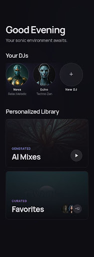
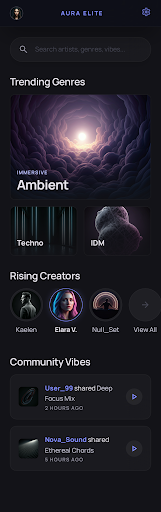
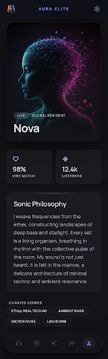
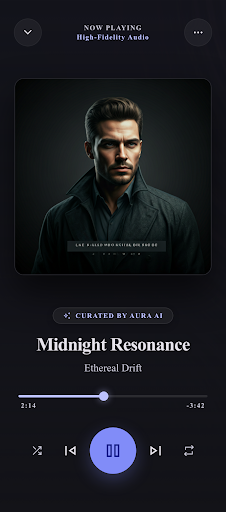
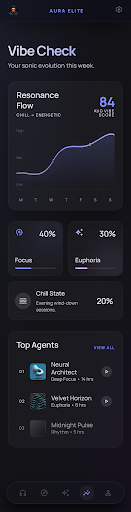
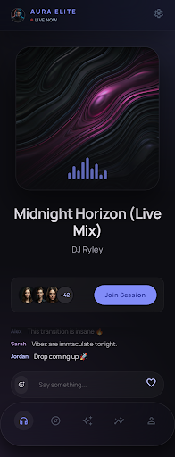

<div align="center">


# HiMu

**Your music, hosted by AI DJs.**

A cross-platform mobile music app built around AI DJ personas. Every DJ has its own
character, signature genres, and curated catalog — stream their tracks through a
full-screen player with background playback, save tracks you like, and watch
your habits come to life in a personal _Vibe Check_.

[](https://expo.dev)
[](https://reactnative.dev)
[](https://www.typescriptlang.org)
[](https://supabase.com)
[](#)
[](LICENSE)

</div>

[](https://reporanker.com/repos/RiveraHan/HiMu)

> **Status:** Beta: core listening and personalization are active; AI generation
> requires the configured Supabase Edge Functions and provider secrets.

---

- [Design](#design)
- [Features](#features)
- [Tech stack](#tech-stack)
- [Architecture](#architecture)
- [Getting started](#getting-started)
- [Environment variables](#environment-variables)
- [Project structure](#project-structure)
- [Scripts](#scripts)
- [Contributing](#contributing)
- [License](#license)

---

## Design

> The images below are the product **design** (built with [Stitch](https://stitch.withgoogle.com/)) — not screenshots of the running app.

|                        Home                        |                        Discover                        |                        DJ profile                        |
| :------------------------------------------------: | :----------------------------------------------------: | :------------------------------------------------------: |
|    |    |    |
|                     **Player**                     |                     **Vibe Check**                     |                     **Live session**                     |
|  |  |  |

---

## Features

**🎧 Listening**

- Full-screen player with album art, a scrubbable progress bar, and queue navigation
- Background audio playback (lock screen / control center) on iOS and Android
- MiniPlayer remains available across authenticated browsing and detail screens;
  auth, full Player, Focus Mode, and onboarding intentionally hide bottom chrome
- Browse and discover DJs from Home and Discover

**🎙️ DJ personas**

- Rich DJ profiles: sonic philosophy, curated genres, and full track list
- "Live now" indicators for DJs currently on air
- Resident DJ badges
- Manual-mix results persist in Activity and recover after an app restart
- Create, train, and cover-generation progress stays visible for the current
  session; generated results never autoplay

**📊 Insights & personalization**

- **Vibe Check** — personal listening stats: top DJs, top genres, and trends over time
- Music preferences that tailor your feed

**🔐 Accounts**

- Google Sign-In with secure, chunked session storage (Expo SecureStore)
- Profile and account settings

**🛠️ Platform**

- iOS, Android, and Web (react-native-web) from a single codebase
- React Native New Architecture + React Compiler, with typed routes
- Dark, glassmorphic UI: Unistyles v3, Expo Blur, linear gradients, Manrope type, Reanimated 4

---

## Tech stack

| Layer        | Technology                                                    |
| ------------ | ------------------------------------------------------------- |
| Framework    | Expo SDK 54 · React Native 0.81 · React 19                    |
| Language     | TypeScript 5.9                                                |
| Navigation   | Expo Router 6 (file-based, typed routes)                      |
| Server state | TanStack Query v5                                             |
| Client state | Zustand 5                                                     |
| Backend      | Supabase — Postgres (RLS), Auth, Realtime, Storage            |
| Auth         | Google Sign-In (`@react-native-google-signin`) + Supabase JWT |
| Audio        | `expo-audio` (background playback)                            |
| Styling      | react-native-unistyles v3 · Expo Blur · expo-linear-gradient  |
| Animation    | Reanimated 4 · Gesture Handler                                |
| Icons & type | lucide-react-native · Manrope                                 |

---

## Architecture

HiMu follows a layered client architecture on top of a Supabase backend:

- **UI** — screens via Expo Router and a reusable component library, animated with Reanimated.
- **State** — Zustand for client state (auth, player) and TanStack Query for server state and caching.
- **Logic** — custom hooks, an auth abstraction over Google Sign-In, the data layer (`supabase-js`), and the audio engine (`expo-audio`).
- **Storage** — sessions persisted to a chunked, secure adapter over Expo SecureStore.
- **Cloud** — Supabase Postgres (with RLS), Auth (Google OAuth → JWT), Realtime, and Storage for avatars and album art.

---

## Getting started

### Prerequisites

- **Node.js 20+** and npm
- A **Supabase** project ([supabase.com](https://supabase.com)) and the [Supabase CLI](https://supabase.com/docs/guides/cli)
- **Google OAuth** credentials (web + iOS client IDs)
- For native builds: **Xcode** (iOS) and/or **Android Studio** (Android)

> **Note:** HiMu relies on native modules (Google Sign-In, background audio), so it
> runs from a **development build** rather than Expo Go.

### Setup

```bash
# 1. Clone and install
git clone <your-repo-url> himu
cd himu
npm install

# 2. Configure environment
cp .env.example .env
# Fill in your Supabase URL + anon key and Google client IDs (see below)

# 3. Set up the database (Supabase CLI)
npx supabase login
npx supabase link --project-ref <your-project-ref>
npm run db:push      # apply migrations from supabase/migrations
npm run db:types     # regenerate src/types/database.ts

# 4. Run a development build
npm run ios          # or: npm run android
```

In Supabase, enable the **Google** provider under _Auth → Providers_ and add the deep
link `com.himu.app://callback` under _Auth → URL Configuration_.

---

## Environment variables

Copy `.env.example` to `.env` and fill in the required values:

| Variable                           | Required | Description                |
| ---------------------------------- | :------: | -------------------------- |
| `EXPO_PUBLIC_SUPABASE_URL`         |    ✅    | Supabase project URL       |
| `EXPO_PUBLIC_SUPABASE_KEY`         |    ✅    | Supabase anon / public key |
| `EXPO_PUBLIC_API_URL`              |    ✅    | Supabase REST endpoint     |
| `EXPO_PUBLIC_GOOGLE_WEB_CLIENT_ID` |    ✅    | Google OAuth web client ID |
| `EXPO_PUBLIC_GOOGLE_IOS_CLIENT_ID` |    ✅    | Google OAuth iOS client ID |
| `EXPO_PUBLIC_TERMS_URL`            |    ◐     | Real, owner-supplied HTTPS Terms destination |
| `EXPO_PUBLIC_PRIVACY_URL`          |    ◐     | Real, owner-supplied HTTPS Privacy destination |

The legal URLs are optional for internal builds but required for a public beta.
AI generation also requires deployed Edge Functions plus the Replicate and R2
server secrets listed in `.env.example`.

---

## Project structure

```
HiMu/
├── app/                      # Expo Router routes (file-based navigation)
│   ├── _layout.tsx           # Root stack, global providers, mini-player
│   ├── (auth)/               # Login (Google Sign-In)
│   ├── (app)/                # Tab group: Home · Discover · Profile
│   ├── dj/[id].tsx           # DJ profile
│   ├── player.tsx            # Full-screen player (modal)
│   ├── vibe-check.tsx        # Listening stats
│   ├── preferences.tsx       # Music preferences
│   └── account-settings.tsx  # Account settings
├── src/
│   ├── api/                  # Supabase client + TanStack Query hooks
│   ├── audio/                # Player provider & audio engine (expo-audio)
│   ├── components/           # Reusable UI (dj, player, vibe, profile, …)
│   ├── hooks/                # Custom hooks
│   ├── stores/               # Zustand stores (auth, player)
│   ├── theme/                # Unistyles tokens & setup
│   ├── types/                # Generated Supabase types
│   ├── lib/ · utils/         # Helpers
├── supabase/
│   ├── migrations/           # Versioned SQL schema
│   └── seed.sql              # Seed data
└── assets/                   # Icons, fonts (Manrope), and design previews
```

---

## Scripts

| Script                            | Action                                                     |
| --------------------------------- | ---------------------------------------------------------- |
| `npm start`                       | Start the Expo dev server                                  |
| `npm run ios` / `npm run android` | Build and run a native development client                  |
| `npm run web`                     | Run in the browser                                         |
| `npm run lint`                    | Lint with `eslint-config-expo`                             |
| `npm run db:push`                 | Apply Supabase migrations                                  |
| `npm run db:types`                | Regenerate `src/types/database.ts` from the linked project |

---

## Contributing

Contributions are welcome. Before opening a pull request:

- Make sure `npm run lint` and `npx tsc --noEmit` pass
- Follow the existing module structure and the design tokens in `src/theme`
- Open an issue first to discuss larger changes

---

## License

Licensed under the [Apache License 2.0](LICENSE).

<div align="center">
<sub>Built with <a href="https://expo.dev">Expo</a>, <a href="https://supabase.com">Supabase</a>, and <a href="https://www.unistyl.es">Unistyles</a>. Icons by <a href="https://lucide.dev">Lucide</a>.</sub>
</div>
